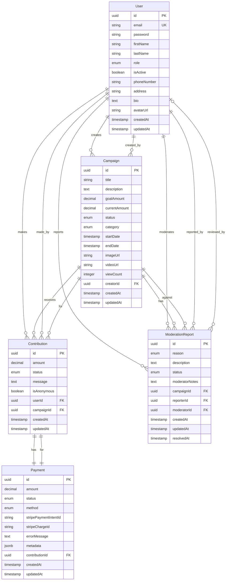

# Architecture de la Base de Données - Diagramme ERD

## Diagramme des Relations



## Légende

- **PK** : Primary Key (Clé primaire)
- **FK** : Foreign Key (Clé étrangère)
- **UK** : Unique Key (Clé unique)
- **||--o{** : One to Many
- **}o--||** : Many to One
- **||--||** : One to One

## Relations Détaillées

### User -> Campaign (One-to-Many)
Un utilisateur peut créer plusieurs campagnes.
- Champ de liaison : `Campaign.creatorId` -> `User.id`

### User -> Contribution (One-to-Many)
Un utilisateur peut faire plusieurs contributions.
- Champ de liaison : `Contribution.userId` -> `User.id`

### Campaign -> Contribution (One-to-Many)
Une campagne peut recevoir plusieurs contributions.
- Champ de liaison : `Contribution.campaignId` -> `Campaign.id`

### Contribution -> Payment (One-to-One)
Chaque contribution a un paiement associé.
- Champ de liaison : `Payment.contributionId` -> `Contribution.id`

### Campaign -> ModerationReport (One-to-Many)
Une campagne peut avoir plusieurs signalements.
- Champ de liaison : `ModerationReport.campaignId` -> `Campaign.id`

### User -> ModerationReport (Many-to-One) - Reporter
Un utilisateur peut créer plusieurs signalements.
- Champ de liaison : `ModerationReport.reporterId` -> `User.id`

### User -> ModerationReport (Many-to-One) - Moderator
Un modérateur peut traiter plusieurs signalements.
- Champ de liaison : `ModerationReport.moderatorId` -> `User.id`

## Énumérations

### UserRole
- `USER` : Utilisateur standard
- `ADMIN` : Administrateur
- `MODERATOR` : Modérateur

### CampaignStatus
- `DRAFT` : Brouillon
- `ACTIVE` : Active
- `SUCCESSFUL` : Réussie
- `FAILED` : Échouée
- `CANCELLED` : Annulée
- `SUSPENDED` : Suspendue

### CampaignCategory
- `TECHNOLOGY` : Technologie
- `ARTS` : Arts
- `SOCIAL` : Social
- `HEALTH` : Santé
- `EDUCATION` : Éducation
- `ENVIRONMENT` : Environnement
- `OTHER` : Autre

### ContributionStatus
- `PENDING` : En attente
- `COMPLETED` : Complétée
- `REFUNDED` : Remboursée
- `FAILED` : Échouée

### PaymentStatus
- `PENDING` : En attente
- `PROCESSING` : En traitement
- `SUCCEEDED` : Réussi
- `FAILED` : Échoué
- `REFUNDED` : Remboursé
- `CANCELLED` : Annulé

### PaymentMethod
- `CARD` : Carte bancaire
- `BANK_TRANSFER` : Virement bancaire
- `PAYPAL` : PayPal

### ModerationReportReason
- `SPAM` : Spam
- `FRAUD` : Fraude
- `INAPPROPRIATE_CONTENT` : Contenu inapproprié
- `MISLEADING` : Trompeur
- `COPYRIGHT_VIOLATION` : Violation de droits d'auteur
- `OTHER` : Autre

### ModerationReportStatus
- `PENDING` : En attente
- `UNDER_REVIEW` : En cours de revue
- `RESOLVED` : Résolu
- `REJECTED` : Rejeté

## Indexes Recommandés (à implémenter)

Pour optimiser les performances, voici les index recommandés :

```sql
-- Index sur les clés étrangères
CREATE INDEX idx_campaign_creator ON campaigns(creatorId);
CREATE INDEX idx_contribution_user ON contributions(userId);
CREATE INDEX idx_contribution_campaign ON contributions(campaignId);
CREATE INDEX idx_payment_contribution ON payments(contributionId);
CREATE INDEX idx_moderation_campaign ON moderation_reports(campaignId);
CREATE INDEX idx_moderation_reporter ON moderation_reports(reporterId);
CREATE INDEX idx_moderation_moderator ON moderation_reports(moderatorId);

-- Index sur les champs fréquemment recherchés
CREATE INDEX idx_campaign_status ON campaigns(status);
CREATE INDEX idx_campaign_category ON campaigns(category);
CREATE INDEX idx_campaign_end_date ON campaigns(endDate);
CREATE INDEX idx_contribution_status ON contributions(status);
CREATE INDEX idx_payment_status ON payments(status);
CREATE INDEX idx_moderation_status ON moderation_reports(status);

-- Index full-text pour la recherche
CREATE INDEX idx_campaign_title ON campaigns USING gin(to_tsvector('english', title));
CREATE INDEX idx_campaign_description ON campaigns USING gin(to_tsvector('english', description));
```

Note : TypeORM crée automatiquement des index sur les clés étrangères, mais vous pouvez les optimiser davantage si nécessaire.
